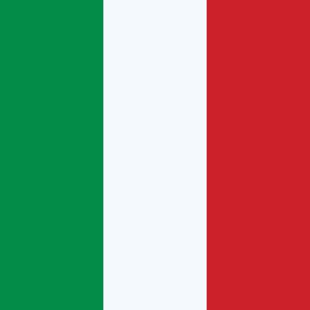

</img>

<table align="right">
 <tr><td><a href="README.md"> English</a></td></tr>
 <tr><td><a href="README_fr.md"> Français</a></td></tr>
 <tr><td><a href="README_pt.md"> Italian</a></td></tr>
</table>

### :space_invader: &nbsp;About Me

&nbsp;&nbsp;&nbsp;:technologist: &nbsp;Currently working as a Tech Lead at [UNESP](https://unesp.br/) (São Paulo State University) \
&nbsp;&nbsp;&nbsp;:seedling: &nbsp;Love for science and innovation.\
&nbsp;&nbsp;&nbsp;:heartbeat: &nbsp;Passionate with problem solving and daily routines automation.\
&nbsp;&nbsp;&nbsp;:writing_hand: &nbsp;Currently researching software architecture, inertial sensors, and sensor fusion.\
&nbsp;&nbsp;&nbsp;:hammer_and_wrench: &nbsp;Coding since 2004 with 10+ years of experience in enterprise wide software development.\
&nbsp;&nbsp;&nbsp;:family_man_woman_girl_girl: &nbsp;Living in Brazil with my lovely wife :two_hearts:, Kali :service_dog:, and Maia :service_dog: .

&nbsp;&nbsp;&nbsp;&nbsp;
&nbsp;&nbsp;&nbsp;&nbsp;

