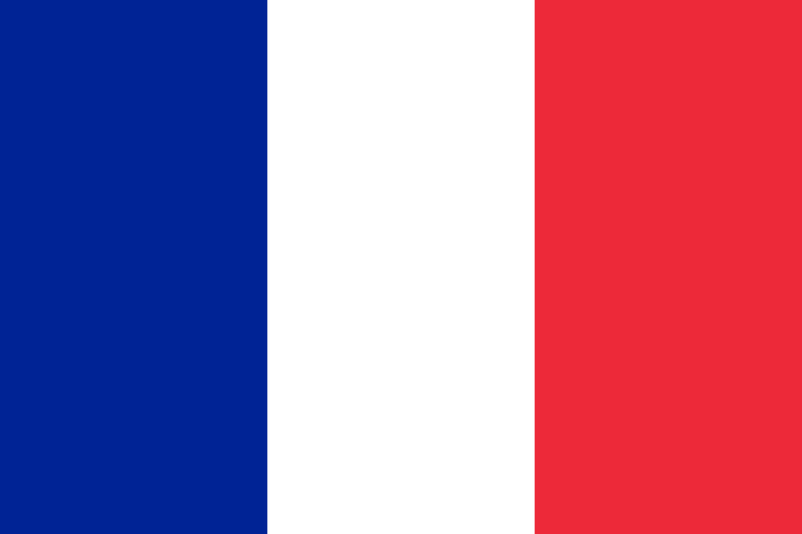
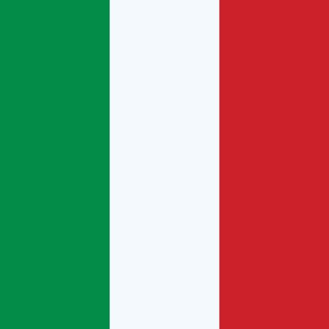

<table align="right">
 <tr><td> English</a></td></tr>
 <tr><td> Français</a></td></tr>
 <tr><td> Italian</a></td></tr>
</table>

### Welcome! :beers:
About me: \
&nbsp;&nbsp;&nbsp;:computer: &nbsp;Datascientist\
&nbsp;&nbsp;&nbsp;:hammer: &nbsp;Currently working at [Heta2](http:http://www.heta2.com/) (Milan, Italy) \
&nbsp;&nbsp;&nbsp;:heart: &nbsp;Love for math\
&nbsp;&nbsp;&nbsp;:cyclone: &nbsp;Crypto enthusiast\
&nbsp;&nbsp;&nbsp;:headphones: &nbsp;[My podcast](https://open.spotify.com/show/0sAcTVn6lUB6LYEc18VDIP)\
&nbsp;&nbsp;&nbsp;:surfer::sunrise_over_mountains::runner:&nbsp;Sports addicted

&nbsp;&nbsp;&nbsp;&nbsp;
&nbsp;&nbsp;&nbsp;&nbsp;

